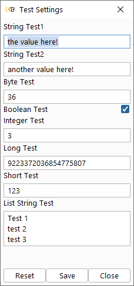

# VirtueMontoyaLibrary

_By [Nick Coblentz](https://www.linkedin.com/in/ncoblentz/)_

__This Burp Montoya Library is made possible by [Virtue Security](https://www.virtuesecurity.com), the Application Penetration Testing consulting company I work for.__

## About

The __Virtue Montoya Library__ provides convenient features to help make building Burp Suite plugins a joy.

## How to Use It

Add the following to your `build.gradle.kts`
```gradle

//add the jitpack.io repository shown below (in addition to any others you require
repositories {
    mavenCentral()
    maven(url="https://jitpack.io") {
        content {
            includeGroup("com.github.milchreis")
            includeGroup("com.github.ncoblentz")
        }
    }
}

//add the following dependencies
dependencies {
    //other dependencies here
    implementation("com.github.ncoblentz:BurpMontoyaLibrary:0.1.12")
    implementation("com.github.milchreis:uibooster:1.21.1")
}
```

## Features

### Logger

Log Levels Supported:
- `DebugLogLevel`
- `WarnLogLevel`
- `ErrorLogLevel`

Example Usage:
```kotlin

private lateinit var Api: MontoyaApi

class MontoyaKotlinSessionAccessTokenHelper : BurpExtension {
    override fun initialize(api: MontoyaApi?) {
        
        Logger = MontoyaLogger(api, MontoyaLogger.DebugLogLevel)
        Logger.debugLog("Plugin Starting...")
        // various extension setup tasks here
        Logger.debugLog( "Finished")
    }
}
```

### Burp Project and Preference Level Persistence and UI Supporting it

This library can be built (`gradlew shadowJar`) and then added as an extension in Burp Suite. It will execute the following plugin: https://github.com/ncoblentz/BurpMontoyaLibrary/blob/master/src/main/java/com/nickcoblentz/montoya/settings/SettingsTest.java. That plugin demonstrates how to create Persistence Settings that are automatically supported by a User Interface. That user interface will be displayed when initially loading the plugin. It will also show by right-clicking an HTTP request and selecting Extensions &gt; Test Settings &gt; Settings. Another example of an extension using this library may be found at: https://github.com/ncoblentz/MontoyaKotlinSessionAccessTokenHelper

All Settings support either Project or Preference level persistence. The following settings types are supported:
- `Boolean`
- `Byte`
- `Integer`
- `Short`
- `Long`
- `String`
- `List<String>`

Example:

```kotlin
package com.nickcoblentz.montoya.settings;

import burp.api.montoya.BurpExtension;
import burp.api.montoya.MontoyaApi;
import burp.api.montoya.persistence.PersistedList;
import com.nickcoblentz.montoya.MontoyaLogger;
import de.milchreis.uibooster.model.Form;
import de.milchreis.uibooster.model.FormBuilder;
import java.util.List;

public class SettingsTest implements BurpExtension {
    private MontoyaApi Api;

    private static final String PluginName = "Test Settings";
    @Override
    public void initialize(MontoyaApi api) {
        Api=api;
        MontoyaLogger logger = new MontoyaLogger(api,MontoyaLogger.DebugLogLevel);
        logger.debugLog("Loading Plugin");
        api.extension().setName(PluginName);
        //ExtensionSetting testSetting1 = new ExtensionSetting(api,"Test1","montoyalibrary.test1","the value here!", ExtensionSettingSaveLocation.PROJECT);
        //ExtensionSetting testSetting2 = new ExtensionSetting(api,"Test2","montoyalibrary.test2","another value here!", ExtensionSettingSaveLocation.PREFERENCE);
        StringExtensionSetting testSetting1 = new StringExtensionSetting(api,"String Test1","montoyalibrary.test1","the value here!", ExtensionSettingSaveLocation.PROJECT);
        StringExtensionSetting testSetting2 = new StringExtensionSetting(api,"String Test2","montoyalibrary.test2","another value here!", ExtensionSettingSaveLocation.PREFERENCE);
        ByteExtensionSetting testSetting3 = new ByteExtensionSetting(api,"Byte Test","montoyalibrary.test3",Byte.valueOf((byte)36), ExtensionSettingSaveLocation.PREFERENCE);
        BooleanExtensionSetting testSetting4 = new BooleanExtensionSetting(api,"Boolean Test","montoyalibrary.test4",Boolean.valueOf(true),ExtensionSettingSaveLocation.PROJECT);
        IntegerExtensionSetting testSetting5 = new IntegerExtensionSetting(api,"Integer Test","montoyalibrary.test5",Integer.valueOf(3),ExtensionSettingSaveLocation.PROJECT);
        LongExtensionSetting testSetting6 = new LongExtensionSetting(api,"Long Test","montoyalibrary.test6",Long.valueOf("9223372036854775807"),ExtensionSettingSaveLocation.PROJECT);
        ShortExtensionSetting testSetting7 = new ShortExtensionSetting(api,"Short Test","montoyalibrary.test7",Short.valueOf((short)123),ExtensionSettingSaveLocation.PROJECT);
        ListStringExtensionSetting testSetting8 = new ListStringExtensionSetting(api,"List String Test","montoyalibrary.test8",List.of("Test 1","test 2", "test 3"),ExtensionSettingSaveLocation.PREFERENCE);

        List<GenericExtensionSetting> extensionSetting = List.of(testSetting1,testSetting2,testSetting3,testSetting4,testSetting5,testSetting6,testSetting7,testSetting8);
        GenericExtensionSettingsFormGenerator gen = new GenericExtensionSettingsFormGenerator(extensionSetting,PluginName);
        FormBuilder settingsFormBuilder = gen.getSettingsFormBuilder();
        Form settingsForm = settingsFormBuilder.run();
        api.userInterface().registerContextMenuItemsProvider(new ExtensionSettingsContextMenuProvider(api,settingsForm));
        logger.debugLog("Finished");
    }
}

```



### Annotations - Append Notes

In Burp Suite, notes can be set on a particular HTTP request/response pair, but it replaces the entire note. This feature concatenates the previous notes with a new note:

Example:
```kotlin
override fun handleRequestToBeSent(interceptedRequest: InterceptedRequest?): ProxyRequestToBeSentAction {
    //some processing here
    interceptedRequest?.annotations().appendNotes("Some Note here")
    //finish processing
    return ProxyRequestToBeSentAction.continueWith(interceptedRequest)
}
```